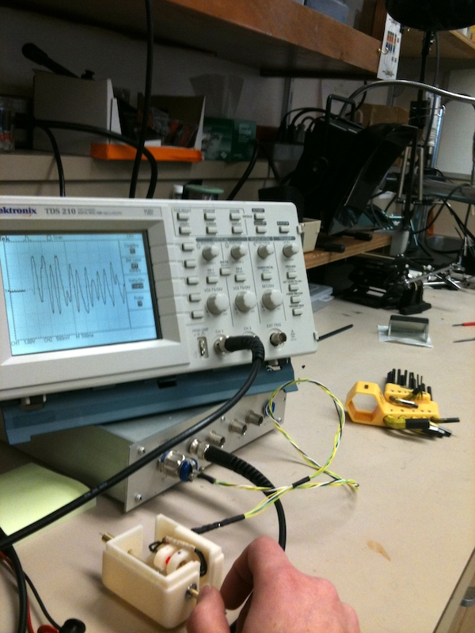

A series of tools designed for observing and experimenting with the mechanics of insect flight. Includes a tethered insect flight simulator which combines a closed loop visual feedback system with an optical transducer that records torque produced by yaw motions -- this allows for (~soft) real time external control of the relationship between insect yaw and resulting movement of the insect's visual field. I was interested in the extent to which feedback gain between torque (yaw) and image motion determines an insect's ability to track a visual stimulus, along with the ability of an insect to adapt to different gains (including negative gain) applied to the feedback loop. The latter investigates the potential for natural plasticity in the visual flight control circuit. 

By using visual stimuli to elicit yaw behaviors in hawkmoths tethered to the custom torque sensor, this research explored whether insects take advantage of timing modulation to accomplish primary control via power muscles. Simultaneous recordings of both pairs of dorsolongitudinal and dorsoventral muscles were obtained using implanted bipolar tungsten electrodes.

These tools were used to collect data for the following papers:
 
* [Abdicating power for control: a precision timing strategy to modulate function of flight power muscles](abdicating.pdf) (Sponberg S, Daniel TL)
* [Autostabilizing airframe articulation: Animal inspired air vehicle control](autostabilizing.pdf) (Dyhr JP, et al.)

## Torque Sensor Components
* 1x tungsten wire/rod (stainless steel torsion wire had terrible hysteresis effects, wasn't strong enough)
* 5x miniature screws (2x top, 2x bottom, 1x mount)
* 2x precision ball bearings (SD 3mm, OD 10mm, width 4mm) ([http://www.mcmaster.com/#7804k128/=cypl5s](http://www.mcmaster.com/#7804k128/=cypl5s))
* 1x brass rod (1/4, 6.35mm diameter) ([http://www.acehardwareoutlet.com...SKU=5391016](http://www.acehardwareoutlet.com/ProductDetails.aspx?SKU=5391016))
* 1x OSI optoelectronics dual photodiode
* 1x 940nm IR LED (wavelength matched for the photodiode)
* 1x AD734 (10MHz, 4-quadrant multiplier/divider) ([http://www.analog.com...product.html](http://www.analog.com/en/special-linear-functions/analog-multipliersdividers/ad734/products/product.html))
* 1x OP467 (quad op-amp) ([http://www.analog.com...product.html](http://www.analog.com/en/all-operational-amplifiers-op-amps/operational-amplifiers-op-amps/op467/products/product.html))
* 1x AD827 (dual op-amp) ([http://www.analog.com...product.html](http://www.analog.com/en/other-products/militaryaerospace/ad827/products/product.html))

## Insect Virtual Flight Arena/Rear Projection System Components
* Curved rear projection screen (sheet of mylar works fine)
* VSL system software
	* Version 1: Torque Sensor Alpha &rarr; Level Shifter &rarr; Arduino &rarr; VSL v1.0 in Processing
	* Version 2: Torque Sensor Alpha &rarr; Level Shifter &rarr; Teensy &rarr; VSL v2.0 in OpenGL/C
	* Version 3: Torque Sensor Beta &rarr; NI DAQ Board Input A &rarr; MATLAB &rarr; Torque Sensor Beta &rarr; NI DAQ Board Input B &rarr; VSL v3.0 in OpenGL/C
	* Version 4: Torque Sensor Beta &rarr; NI DAQ Board &rarr; VSL v4.0 in OpenGL/C with (optional) MATLAB export
* PCB design software (eagle, kikad)
* [80-20](http://www.8020.net/) for the arena frame, with a curved sheet of mylar acting as the rear projection screen
* TI pico projector ([http://www.ti.com/tool/dlp1picokit](http://www.ti.com/tool/dlp1picokit)) for projecting visual stimulus onto the convex surface of the curved mylar
* (optional) low-pass filter/instrumentation amp from [Alligator Technologies]( http://www.alligatortech.com/USBPGF-S1_USB_programmable_instrumentation_amplifier_low_pass_anti_alias_filter.htm) to filter out the wingbeat frequency
* NI-DAQ board for data collection 

	
	
	
	
	
	

## Notes
The torque sensor and associated divider circuit allow for measuring the yaw motions of tethered insects mid-flight. Upgrades from previous builds:
* Used low impedance wire (also: used the same wire for all connections)
* Add capacitors to the photodiode splitter circuit
* The Alligator Tech low-pass filter/instrumentation amp helps a ton with filtering out wingbeat frequencies

Delay is an issue, in both circuits and visual refresh rates. Most projectors don't refresh the display image as often as the refresh rate would imply, and documentation on this is (frustratingly) lacking. Ideally this entire system would be implemented in a realtime OS.

The top plot represents the movement of the pattern presented to the insect -- in this case a single horizontal bar moving back and forth across the insect's visual field. The bottom plot is the torque recorded during this time; the insect's attempts to follow the horizontal bar are apparent.

