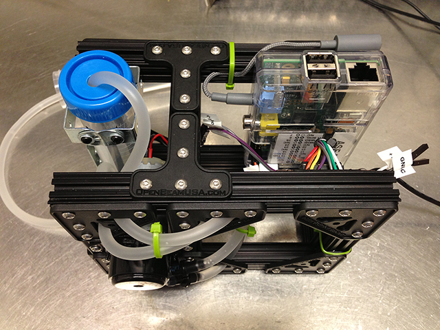
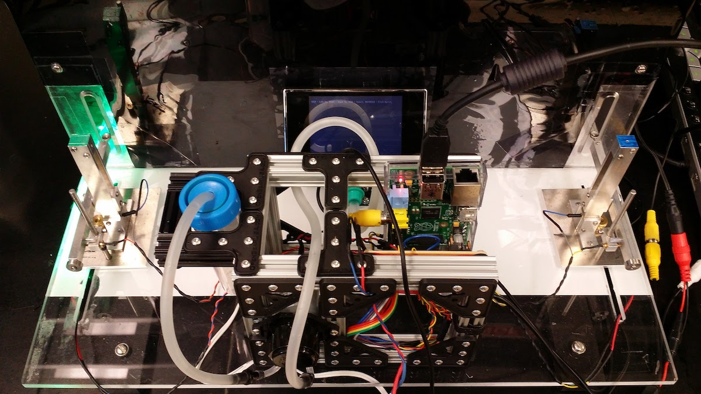
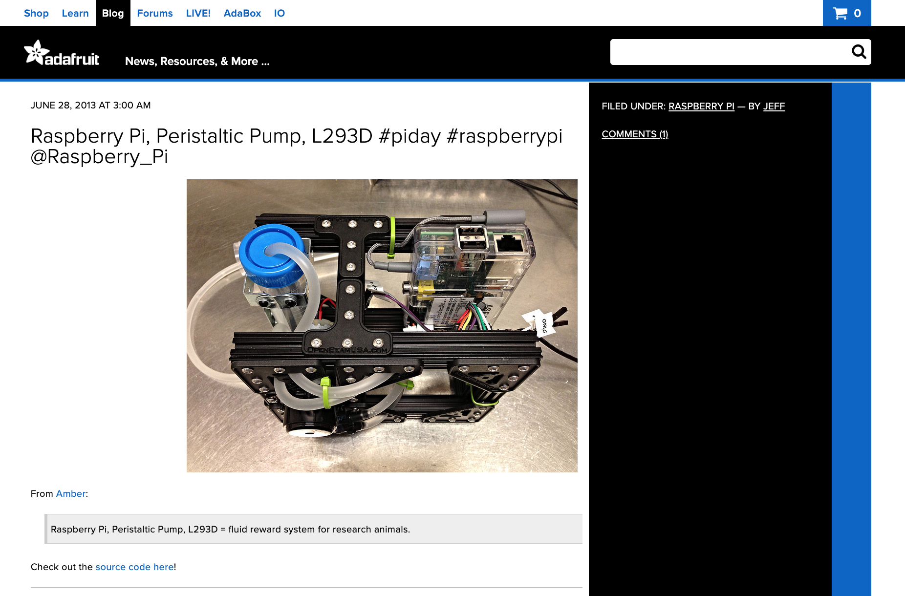

Most commercial water/fluid reward systems utilized in research environments can be costly, often exceeding a few hundred dollars, and present challenges in modification or integration with existing hardware. This guide presents a series of efficient, cost-effective solutions, with expenses under $100, and potentially less if some components are already available. Utilizing a peristaltic pump is recommended due to its design, which prevents direct contact between the motor and fluid. Three distinct versions are provided: the Raspberry Pi version, which is the most robust, employing a Texas Instruments L293D quadruple half-H driver and an Adafruit peristaltic pump; another version using an Arduino with a SeeedStudio motor shield or a compatible alternative; and finally, an Arduino-based version with an L293D driver.

<a href="pumpmini.jpg"></a>

## Components

* Peristaltic liquid pump (12VDC / 300mA) with silicone tubing (max flow 100mL/min): [http://www.adafruit.com/products/1150](http://www.adafruit.com/products/1150)
* 12VDC adapter to power the motor
* Programmable device to control motor activity:
	* [Option 1] Raspberry Pi Model B: [http://www.newark.com/jsp/search/productdetail.jsp?sku=43W5302](http://www.newark.com/jsp/search/productdetail.jsp?sku=43W5302)
	* [Option 2] Arduino Uno (Or similar): [http://arduino.cc/en/Main/arduinoBoardUno](http://arduino.cc/en/Main/arduinoBoardUno)
* Some way of routing power to/driving the motor:
	* [Option 1] L293D: [http://www.ti.com/lit/ds/symlink/l293d.pdf](http://www.ti.com/lit/ds/symlink/l293d.pdf) / [http://www.adafruit.com/products/807](http://www.adafruit.com/products/807)
	* [Option 2] Arduino Only: Seeed Motor Shield (any motor shield that fits the Arduino) [http://www.seeedstudio.com/](http://www.seeedstudio.com/depot/motor-shield-p-913.html)
	* [Option 3] Power Transistor
* [Optional] Momentary push button/switch + 10kOhm resistor for manual fluid delivery

## Notes
### Raspberry Pi (or Arduino) with L293D

Git repo: [https://github.com/hologramber/peristaltic-pump-reward-system/tree/master/raspberry_L293D_version](https://github.com/hologramber/peristaltic-pump-reward-system/tree/master/raspberry_L293D_version)

* Wiring diagram can be found below, and the L293D pinout can be found here: [http://www.ti.com/lit/ds/symlink/l293d.pdf](http://www.ti.com/lit/ds/symlink/l293d.pdf) -- additionally the DC motor tutorials at Adafruit (for both Arduino and Raspberry Pi) might be useful as a secondary reference if there is any trouble getting the motor running.
* Update the Raspberry Pi & install WiringPi2 (Python port) from GitHub:

```bash
	> sudo apt-get update
	> sudo apt-get upgrade
	> sudo apt-get install git-core
	> git clone git://github.com/WiringPi/WiringPi2-Python.git
	> cd wiringPi2-Python
	> sudo python setup.py install
```

* Build everything! (Breadboard -> Final Version)
* Download and run [this hack of a Python script](https://github.com/hologramber/peristaltic-pump-reward-system/blob/master/raspberry_L293D_version/L293D_pump_code_wiringPi.py) to drive the motor
	* ("startx" to enter the Raspberry Pi desktop environment before running this script -- if you wish to run everything from the console, cut out all of the pygame code)
	* Press "w" to run the pump briefly
	* Press "esc" to quit the program
	* This line controls both the motor step size (1000) and the length of time the motor runs (1 second): motor.motor_loop(1000,1) -- modify it as needed

There's another Python script in the git repository which can be used w/the Adafruit Occidentalis distro that doesn't require wiringPi be installed.

### Arduino & SeeedStudio Motor Shield

Git repo: [https://github.com/hologramber/peristaltic-pump-reward-system/tree/master/arduino_version](https://github.com/hologramber/peristaltic-pump-reward-system/tree/master/arduino_version)

* If using Seeed motor shield a compatible Arduino pinout is needed -- the duemilanova or the uno both work well. This motor shield is overkill, but it's cheap/simple & the wiki has good information: [http://www.seeedstudio.com/wiki/Motor\_Shield\_V1.0](http://www.seeedstudio.com/wiki/Motor\_Shield\_V1.0)
* Connect DC power adapter to the motor shield Vs / Gnd pins, and connect the motor to the M1+ / M1- pins
* Connect the motor shield to the Arduino
* Upload [Arduino code](https://github.com/hologramber/peristaltic-pump-reward-system/blob/master/arduino_version/arduino_motor_shield_drive/arduino_motor_shield_drive.ino) via USB
* If the J6 jumper is left connected, a separate power source to the Arduino isn't necessary (it will pull power from the motor shield).
* For a manual “push button to dispense fluid” feature, a button module is available from Seeed -- connect it via their Grove system to make life easy, but a 10kOhm resistor and an old button switch will also work.

```txt
		Switch
			|
			|------------
			|           |
			|           |
			|          / \
		    5V        /   \
				10kOhm   Arduino Pin #5
			   Resistor
					|
					|
				   Gnd
```

### Other Notes

This system was used frequently for distributing fluid-based rewards for a variety of lab experiments -- an example arena is shown below. And a bit unrelated, but I was chuffed to see this project mentioned on the Adafruit site. 

<div class="cga-flex-content">
	<a href="trainingarena.jpg"></a>
	<a href="adafruitpump.png"></a>
</div>