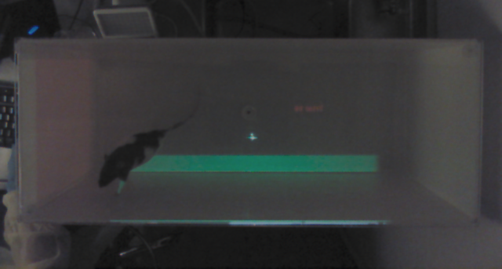
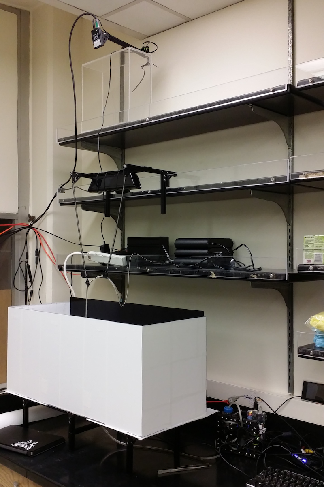
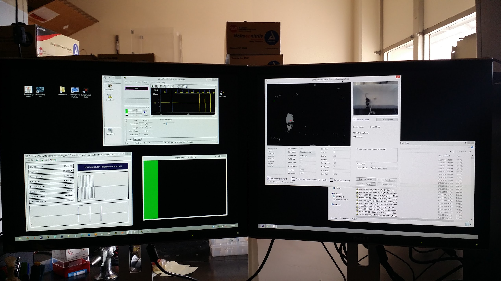

Sensory augmentation is a research area focused on enhancing an organism's perception by providing additional sensory input, thereby expanding the range of environmental cues available for processing. This can lead to a more comprehensive understanding of the surroundings and an improved ability to navigate complex tasks. In the context of the following experiment, sensory augmentation is explored through the use of intracortical microstimulation in conjunction with traditional visual cues.

In this study, naive rats were trained to perform a "paws up" action on a bar of light displayed in an empty training arena. Successful completion of the task resulted in a fluid reward (apple juice) dispensed from the center of the arena. Following the implantation of a <a href="/bytes/2015-04-02-intracortical-array/">custom recording/stimulation array</a>, intracortical microstimulation cues were paired with the light. Gradually, the visual cue was phased out, and the intracortical stimulation served as the sole cue for the task.

	
	

Rats easily learn the basic task, but the experimental parameters in question ranged from identifying ideal microstimulation parameters, to evaluating the degree of information fidelity that was possible with this method of conveying information, and whether this could be used as an additional source of environmental context paired with other cues (hence "sensory augmentation").

TuckerDavis neurophysiology hardware was used for delivering intracortical microstimulation. Automated rat tracking & task evaluation were accomplished with a Microsoft Kinect positioned above a blank arena with custom software used to follow the rat's position in concert with the task parameters. When the rat was tracked to the position where the microstimulation cue suggested, <a href="/bytes/2015-01-19-diy-peristaltic-pump/">apple juice was delivered from the center point with a custom peristaltic pump controller</a>.

