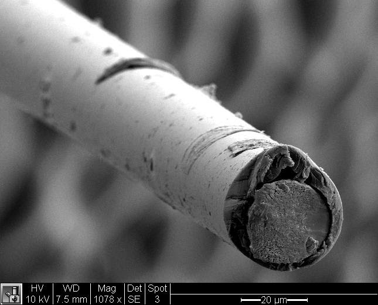
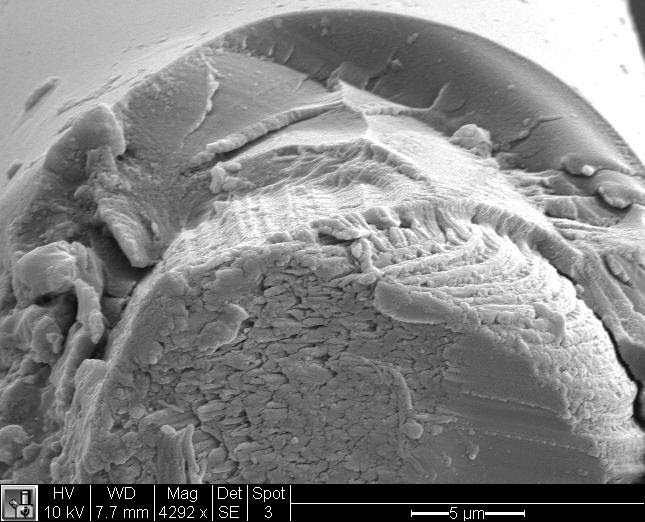
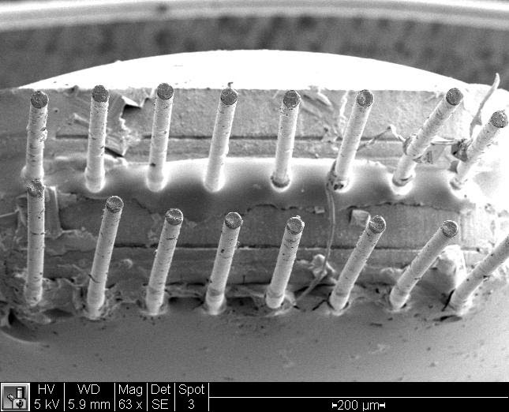
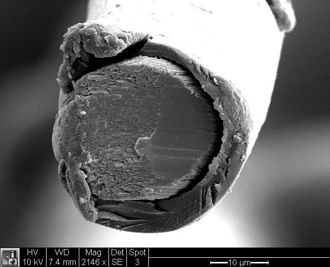
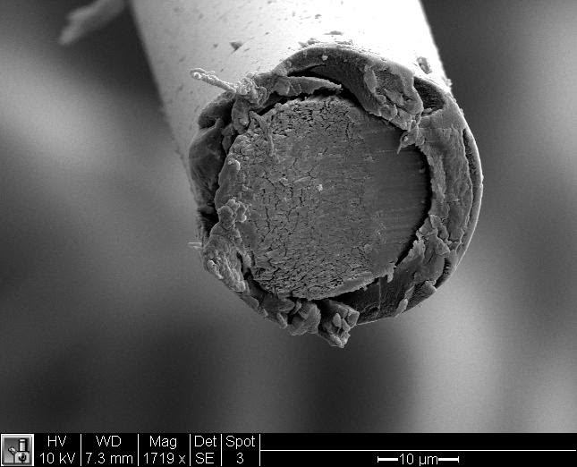
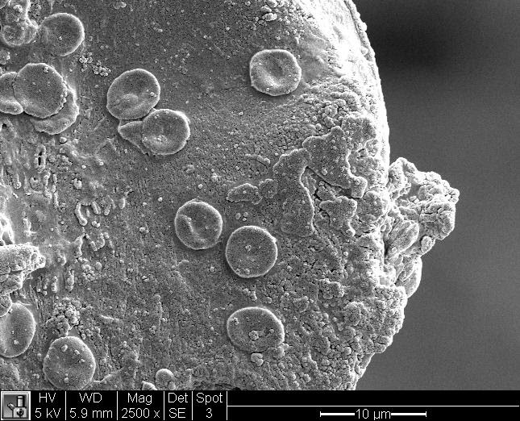

My first scanning electron microscopy (SEM) images of custom intracortical recording/stimulation microelectrodes I designed and fabricated for a variety of <a href="/bytes/2015-03-21-sensory-augmentation/">neural interface experiments</a>. What a weird world exists at this level of magnification.

This was part of a study done to compare degradation and/or encapsulation of different microwire insulation materials after being explanted. 

Neural implants, while offering great potential for treating neurological disorders and enhancing human capabilities, face challenges related to the body's immune response. When a foreign object, such as a neural implant, is introduced into the body, the immune system perceives it as a potential threat and initiates an inflammatory response to protect the host. This immune response is mediated by various cell types, including microglia, astrocytes, and macrophages, which converge around the implant site to form a barrier, known as the glial scar. The formation of this scar can lead to the encapsulation and isolation of the implant, ultimately impairing its functionality and biocompatibility. Additionally, the chronic inflammation and subsequent release of pro-inflammatory cytokines can contribute to tissue damage and further compromise the long-term stability and performance of the neural implant. Therefore, understanding and mitigating the immune response to neural implants is critical for the development of more effective and reliable devices for both research and clinical applications.

	
	
    

	
	
    

