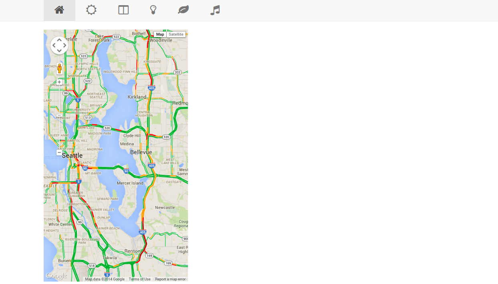
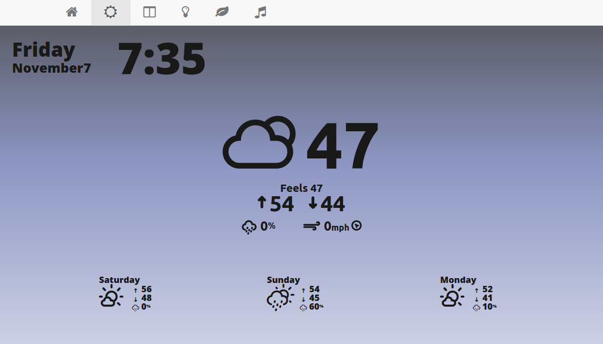
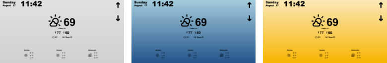
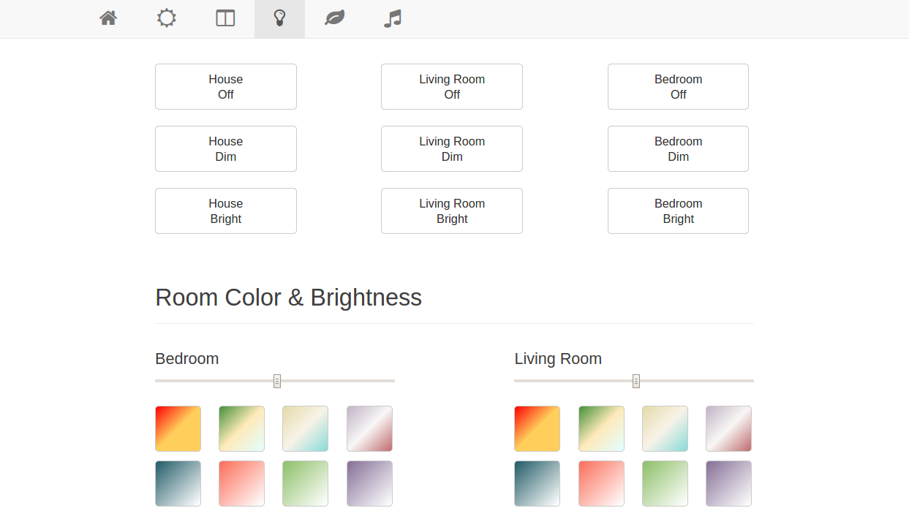
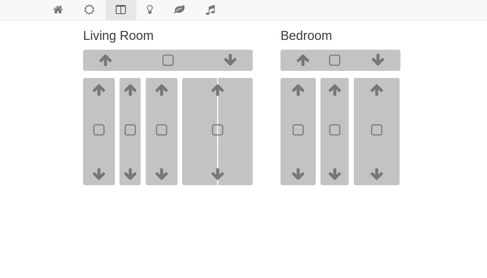
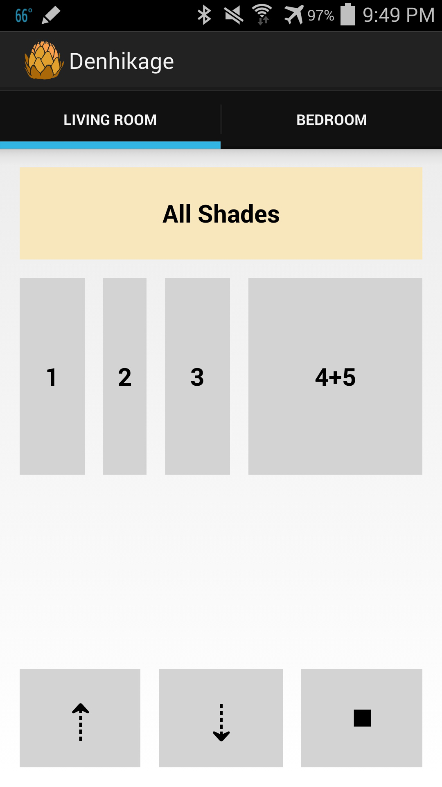
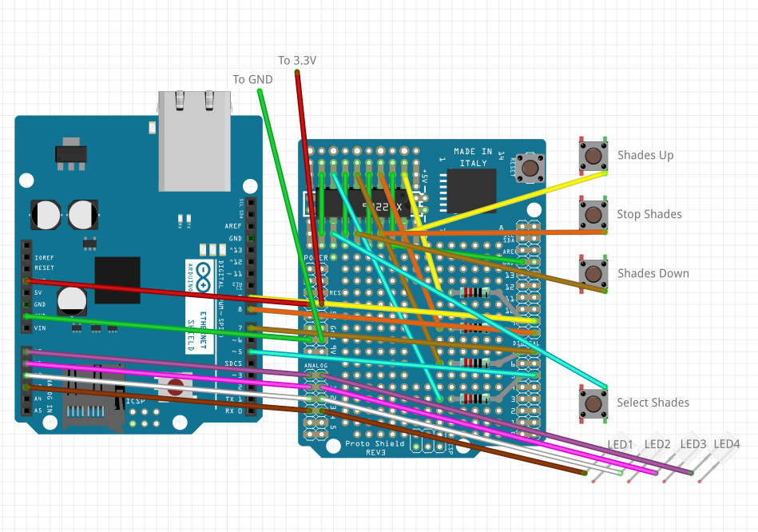
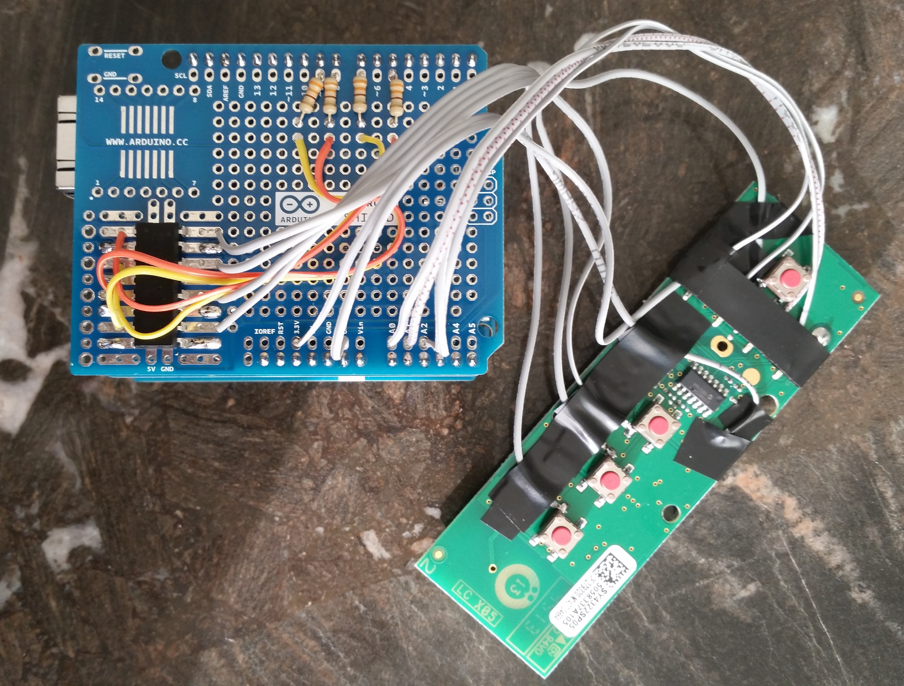

Centralized control dashboard to consolidate the operation of, and extend the options for, various "smart home" systems (Hue, Nest, Sonos, Somfy, etc) into a single place. Bonus unfortunate (but perhaps not unexpected) realization that most of these products have the security of a wet paper bag full of weights.

## Basic Components & Steps
* Raspberry Pi: [http://www.raspberrypi.org](http://www.raspberrypi.org/)
* Apache Web Server: [https://httpd.apache.org](https://httpd.apache.org/)

1. Install an OS on the Raspberry Pi. Raspbian/Debian Wheezy image from: [http://www.raspberrypi.org/downloads](http://www.raspberrypi.org/downloads/) is fine
2. Update and upgrade the Pi (sudo apt-get update && sudo apt-get upgrade)
3. Install Apache ([http://www.raspberrypi.org/documentation/remote-access/web-server/apache.md](http://www.raspberrypi.org/documentation/remote-access/web-server/apache.md))
4. Install Node.js if you plan to use the Sonos Controller (see below)
5. Download the project source and stick it in the web root folder (proably /var/www)
6. Acquire necessary API keys for the personal use (Google Maps, Weather Underground)

## Home Screen
<a href="home.png"></a>

The header tab navigation/general page aesthetics are css-styled via bootstrap with some additional modifications that probably qualify as a crime against standardization. Font awesome icons are used in the navigation tabs. Currently the traffic map stands alone on half the page; I might extend it to fill the content width to make things look less awkward. 

* Google Maps API: [https://developers.google.com/maps/documentation/javascript/reference](https://developers.google.com/maps/documentation/javascript/reference)
* API Key for Google Maps (Log in > Services > Google Maps JS APIv3 > API Access > Key for browser apps): [https://code.google.com/apis/console](https://code.google.com/apis/console)

## Weather Update
<a href="weather.png"></a>

Basic splash page to display date/time/current+future weather conditions. I used the default Weather app under Windows 8 as a perpetual display for some time, but Microsoft made the unfortunate decision to use it for advertising as well. This works best as a perpetual display, not as an occasionally-visited browser tab.

* WUnderground API: [http://www.wunderground.com/weather/api/](http://www.wunderground.com/weather/api/)
* REQUIRES A WEATHER UNDERGROUND API KEY! They currently have a free tier, but it requires registration.
* WeatherIcons: [https://github.com/erikflowers/weather-icons](https://github.com/erikflowers/weather-icons)

### Weather Notes
* The WUnderground API is pretty restrictive (<500 calls in 24h).. but it's free, so thank you WUnderground! If you go over the limit, you'll receive a few warnings (2?) before they cut the access.
* The arrows on the ride side control the sun shades (see below).
* I had some weird issues with Firefox and auto-refresh.. occasionally characters would fail to appear on the page, but I could fix this by resizing (or refreshing) the page itself.
* Needs an hourly view for the current day, and possibly changing the rain cloud percentage to something else.. multiple people have asked me if that's percent humidity, but it's supposed to be percent chance of rain. Debating signing up for a paid WUnderground plan so I have access to more data.
* Currently I'm grabbing the "name" of the weather (cloudy, sunny, etc) from the icon that WUnderground would normally assign. This changes the page's weather icon along w/the color of the background. Grey for cloudy, blue for rain, yellow for sun:

<a href="weather-gby.png"></a>

* Also dark grey/black for night, as well as green for "oh no, there's an error" or "I haven't encountered this weather-name before." I'm not 100% happy with these gradients, but I haven't thought of a better way to display current conditions. Considering going the Yahoo! Weather route and pulling CC-licensed images from Flickr which match the current weather conditions.

## Light Control (Hue)
<a href="lights.png"></a>

Interacting with the Philips Hue lights is both surprisingly and alarmingly easy. Authentication with the Hue bridge is done via plaintext http and only requires a known username for full authentication ("new" users require physical authentication through the hub, but existing usernames can be easily hijacked). Anyone on the same network would have little trouble taking control of the lights. That said, interacting with the Hue system is fairly straightforward, and the jsHue library from John Peloquin (link below) is an eloquent interface for the Hue API.

Commands are sent to the Hue system as URL strings. The API debug tool (http://<bridge ip address>/debug/clip.html) is a good way of getting a feel for how you send/receive data from the bridge. 

* John Peloquin's jsHue Library: [https://github.com/blargoner/jshue](https://github.com/blargoner/jshue) 
* Hue API Debug: [http://www.developers.meethue.com/documentation/getting-started](http://www.developers.meethue.com/documentation/getting-started)
* Philips Hue Developer API: [http://www.developers.meethue.com/philips-hue-api](http://www.developers.meethue.com/philips-hue-api)
* jsColor Library

## Sun Shade Control
<a href="shades.png"></a>

Automatic/ethernet-based sun shade control for a pre-existing Somfy installation. A Somfy RF board connected to an Arduino w/an ethernet shield is used for back-end control, w/an Android app or web browser used for sending commands. Shade activation works by accessing custom URLs via the internal network to indicate desired shade mechanism. Should not be used without some layer of security, which depends on the network. 

* Arduino Uno (any Arduino will work)
* Arduino Ethernet shield (R3 for Uno)
* Protoshield for Arduino
* Somfy RF board (whatever model is appropriate for the number of channels you wish to control)
* Optoisolators; one for each channel that you plan to use: [https://www.sparkfun.com/products/784](https://www.sparkfun.com/products/784)
* Resistors (~350 Ohm)

### Sun Shade Notes
<a href="denhikage-ss.png"></a>

* Somfy RF boards can be harvested from Somfy remotes -- purchase one that has however many channels you wish to replicate. To clone an existing remote's settings, put both remotes on the channel you want to clone, then hold the button on the back of the original remote down for 2s (the shades will move up/down briefly), followed by holding the button on the back of the new remote down for 2s (the shades will again move up/down briefly). I seemed to have some issues with this process if I tried to do sequential channel programming, so after doing one channel, I'd wait about 5 minutes, do another channel, etc.
* More information on Somfy systems can be found here: [http://www.somfy.com/.../literature/instructions](http://www.somfy.com/nam_pro/index.cfm?page=/nam_pro/home/trade/commercial_literature/instructions)
* A single Android app controls both, I tried to make the shade shapes roughly translate to the shade shapes IRL. You select the shade, and then hit up, down, or stop. The app works by sending a request to a specific URL at the IP of each arduino -- when those requests are received, the arduino parses the URL to extract the command. This also means you can control the shades via the computer.
* Arduino connects to ethernet shield which connects to the protoboard. Each 'control' (up, down, stop, and select) is run through an optoisolator (quad chip used in these examples) before connecting to a digital pin. Each LED is connected to an analog pin. I'm really bad at Fritzing, it turns out, but here's a spiderweb to illustrate.

<div class="cga-flex-content">
	<a href="layout-messy.png"></a>
	<a href="denhikageboard.jpg"></a>
</div>

## Music Dashboard (Sonos)
Modified version of jishi's Node.js Sonos Web Controller. I primarily listen to Pandora channels over the Sonos system -- currently those must be added as favorites through another interface to be visible in this web controller. To add different Sonos zones to a group, drag and drop in the left-hand column. 

* Sonos Music System: [http://www.sonos.com](http://www.sonos.com/)
* Node.js: [http://nodejs.org](http://nodejs.org/)
* Sonos Controller for Node.js: [https://github.com/jishi/node-sonos-web-controller](https://github.com/jishi/node-sonos-web-controller)

Installing Node.js & have Node.js start the Sonos interface on boot, add this to the rc.local file:
```bash
$ wget http://node-arm.herokuapp.com/node\_latest\_armhf.deb
$ sudo dpkg -i node\_latest\_armhf.deb
$ su pi -c 'node /var/www/sonos/server.js < /dev/null &'
```