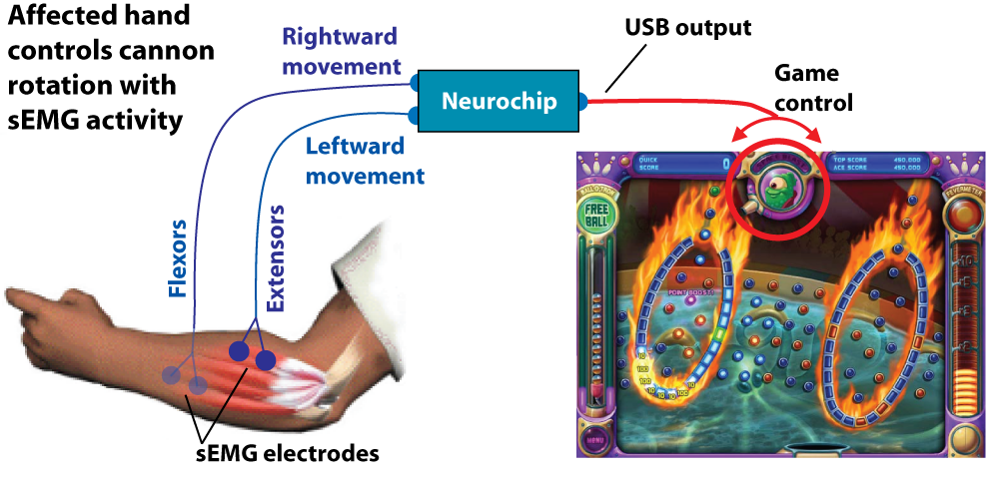
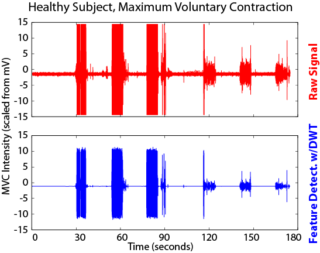
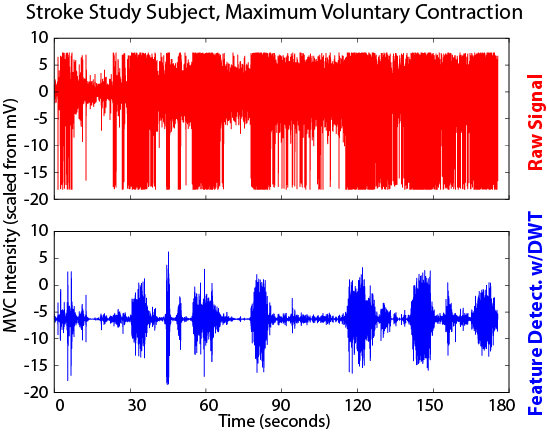

This writeup comes long after the fact; the GitHub repo is an archive of old project code with no refactoring or cleanup. 

The EMG controlled game system (affectionately known as NeuroGame, or NG) was designed as a combination hardware/software platform which provides augmented visual feedback based on appropriate and selective muscle activation via real-time surface EMG recordings. It employs online wavelet analysis in auto-calibrating the software response to a series of sEMG signal inputs without human intervention. The initial clinical studies used a commercially available video game (Peggle) as the mechanism for biofeedback, but the software was designed to be modular and functions equally well with a number of other game options.

These tools were used to collect data for the following papers:
* [Preliminary Investigation of an EMG-controlled Video Game as a Home Program for Persons in the Chronic Phase of Stroke Recovery](ng_cs.pdf) (Donoso Brown EV, et al.)
* [NeuroGame Therapy to improve wrist control in children with cerebral palsy: A case series](ng_devneuro.pdf) (Rios DC, et al.)
* [Understanding upper extremity home programs and the use of gaming technology for persons after stroke](ng_programs.pdf) (Donoso Brown EV, et al.)

## General Operation
Physical therapy (PT) is often tedious and one might say... lacking in fun, which means most people don't adhere to their PT routines at home, especially over extended periods of time. By linking a more engaging activity (controlling a video game) with the PT movements (flexion and extension of the wrist, in our trials), and allowing clinical staff to monitor progress remotely, I was hoping that there'd be more functional improvement over traditional PT routines which often have lower patient adherence.

## Progress Tracking
While the system would auto calibrate (a necessity because electrical noise varied across both environments and sessions), the "difficulty" could be adjusted remotely by clinical staff -- essentially requiring a patient to flex/extend their wrist more forcefully, or for a longer period of time. Our two initial cohorts were 1) adults in the chronic phase of stroke recovery (more than 6 months post-stroke) and 2) children with cerebral palsy. Initial ranges of motion (RoM) and grip strength varied widely between the two groups, as did rate of progress (demonstrated by increases in RoM and grip strength) through the course of the trial.

In both groups, I saw increased range of motion and grip strength, especially in those patients with relatively normal sensation in the hand and arm. Perhaps more notably, there was increased adherence to the PT routines -- both adults and youth expressed an enjoyment for playing the game this way, although the youth group's adherence was the most strongest.

The majority of children performed their neurogame therapy routines at home as much or more than requested, based on data logged by the system. The level of compliance in the youth group is encouraging for future clinical applications of a similar system as a motivating augmentation to therapy performed in any setting. 

In contrast, only ~1/3rd of adult participants completed or exceeded the recommended amount of system use. Future studies should include systematic collection of qualitative data in order to understand participant experiences -- could this be improved with a more user friendly interface? More game options? Better display of session-to-session improvement? Possibly all of the above.

## EMG Recording
The sEMG signals were initially acquired using the first generation USB/serial <a href="http://csne-erc.org/research-dissemination/neurochip">neurochip</a> interface. Five physical leads were used; 2 on a flexor muscle, 2 on an extensor muscle, and 1 ground/reference lead placed elsewhere (e.g. on the elbow, with little to no muscular activity). The leads connected to disposable ECG electrode stickers which were replaced for each session. Later versions used a wireless bluetooth interface with reusable electrodes, but it was hard to beat the ECG stickers as far as signal quality goes.

## Autocalibration
Wavelets are functions that provide an orthonormal basis for functions in the L2 space. The use of wavelets is akin to the use of sines and cosines to represent L2 functions in Fourier analysis. The discrete wavelet transform iteratively transforms a signal of interest into multi-resolution subsets of coefficients. I used a discrete wavelet transform on the raw EMG signal during maximum voluntary contraction to generate the detail coefficients. Most functions, smooth or otherwise, have sparse representation in a wavelet basis, which is ideal for feature detection in time-varying signals. I applied soft thresholding using a universal threshold on these coefficients (x*sqrt(2log(N))), where x is a robust estimator of the standard deviation of the finest level detail coefficients. Then I used the standardized median absolute deviation (x = MAD(Bj-1)) to complete the threshold. Applying the inverse discrete wavelet transform to the thresholded coefficients produces excellent feature discrimination from EMG signals recorded in both healthy individuals, as well as traditionally more difficult-to-analyze signals seen in those with motor deficits. In healthy subjects, feature detection is often feasible from the raw signal alone, but this becomes impossible with noisy/co-contracting muscles in patients with motor deficits. This calibration process iterates 3 times during the period where maximum voluntary contractions are performed prior to game-play.  

	
	

