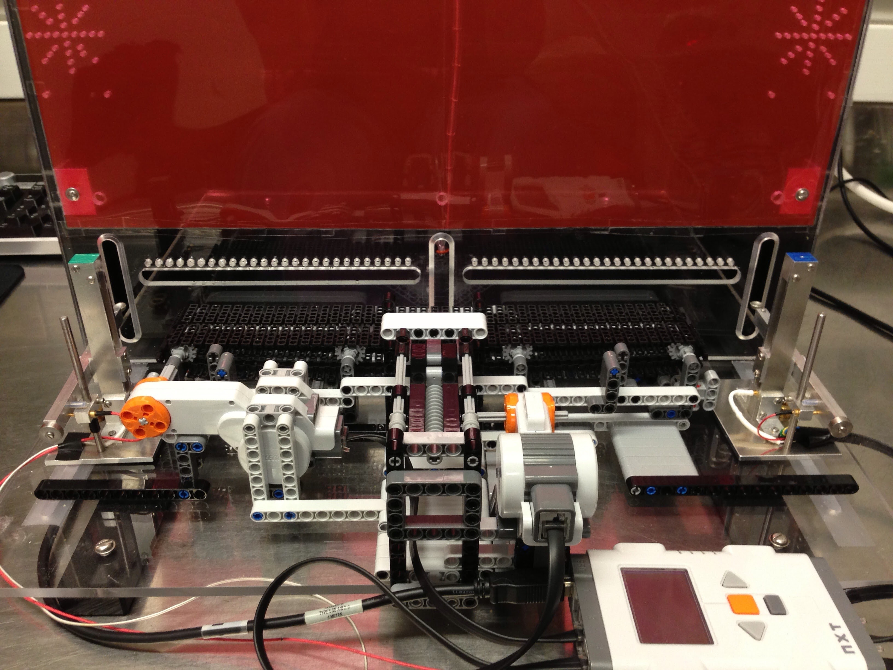
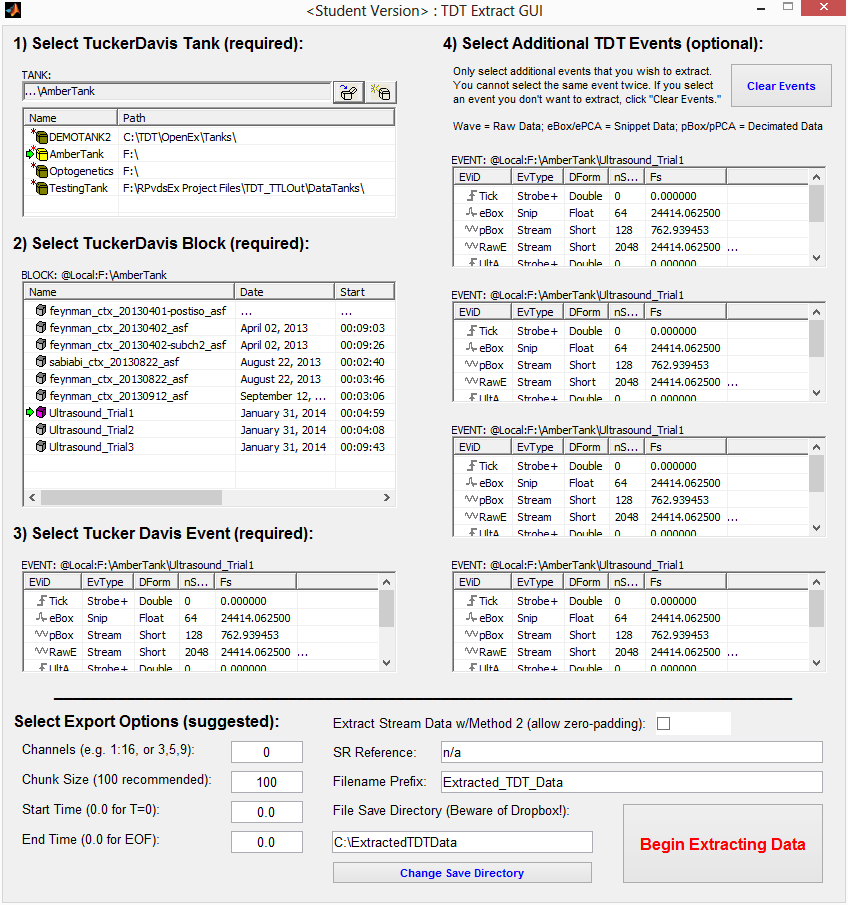
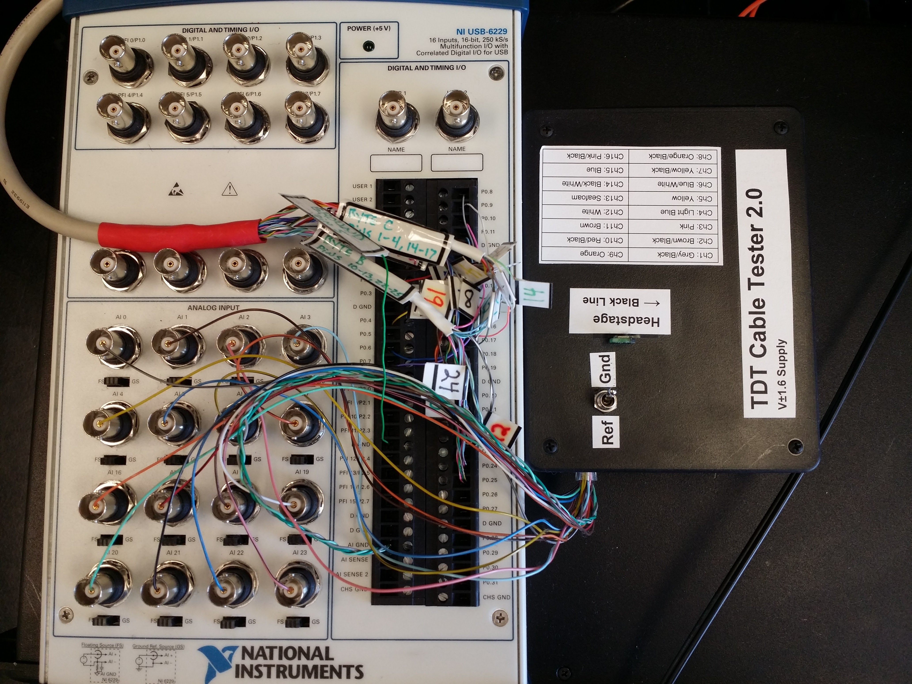

Tucker-Davis Technologies, or TDT, is a provider of neurophysiology hardware and software solutions used in a variety of research applications. Their hardware includes amplifiers, filters, electrodes, and other components that allow for the real-time recording of electrical activity from the brain and other parts of the nervous system. This is a series of tools, fun projects, and software packages used for working within the TDT environment.

## Tucker-Davis + Lego Mindstorms NXT Connection

https://github.com/hologramber/tdt-nxt-connection

Uses lever inputs on a Mindstorms NXT brick (the “button” NXT input is a simple contact circuit; it's possible to rig a custom lever system by halving an NXT accessory cable and creating an open circuit lever with whatever components are available) to cue a Tucker Davis system epoch while recording neural data. Requires TDT OpenDeveloper. This is absolutely overkill – an Arduino (or similar) is a better solution unless the NXT has a purpose for something else as well (e.g. conveyor belt). This was fun, though.

## TDT Tank Format Data Extraction

https://github.com/hologramber/tdt-extraction-gui

Data extraction tools / GUI in MATLAB for wrangling neuro/electrophys data stored in TDT (Tucker-Davis Technologies) tank format – OpenDeveloper must be installed for this code to work.

- OpenDeveloper can be acquired from TDT: http://www.tdt.com/downloads.html
- This works via ActiveX calls -- they must be enabled on the operating system side
- Data extracted relative to a specific tank is useful for matching Epoch Data to recording data timestamps
- Extracting from an empty store with no epoch trigger will fail (this is a bug)

## Tucker-Davis Cable Integrity Tester

https://github.com/hologramber/tuckerdavis-cable-tester

Extremely quick active/passive cable tester for TDT cables – useful when lab animals view $1k+ cables as a fine delicacy. Project could be vastly improved without the overkill of a DAQ board, but it was what I had sitting around at the time. Requires an Arduino Mega and a current LabVIEW (sorry.. ) installation.

