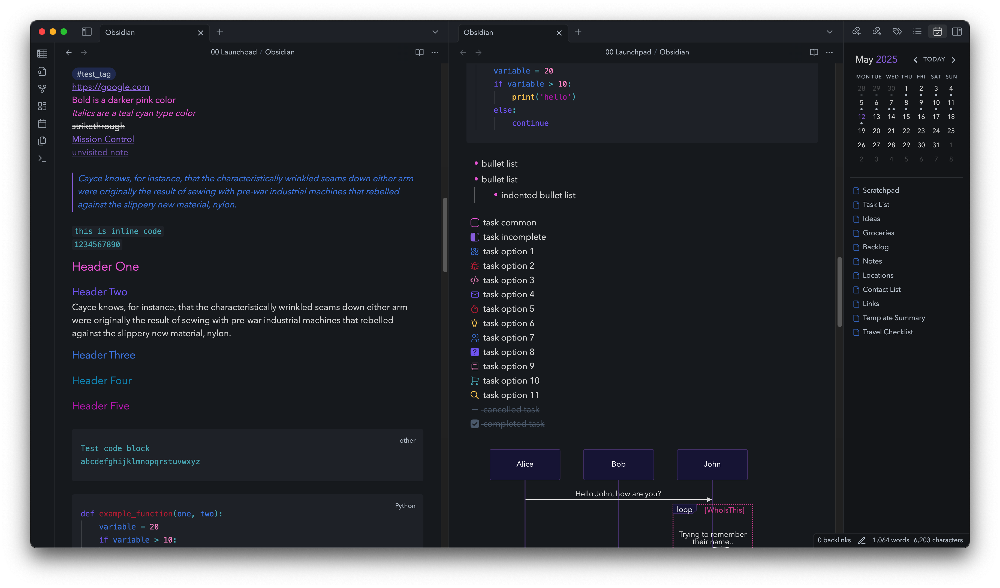
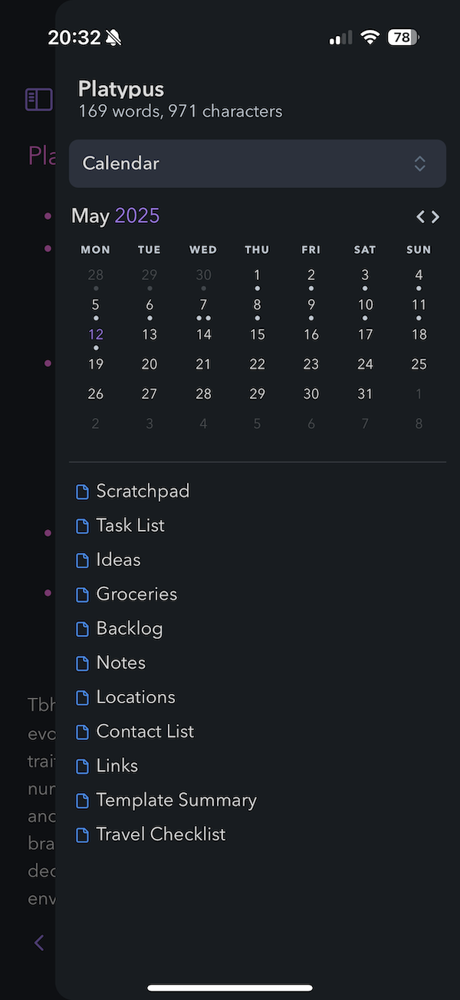
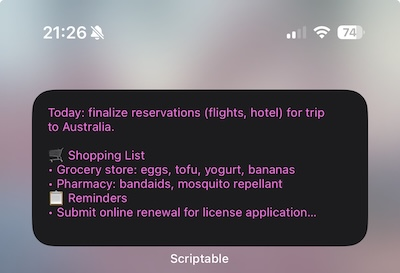

I use Obsidian for collecting information; notes, ideas, reminders, grocery lists, thoughts, reference, etc. My requirements for a notes app are: multiple device support, expectation of data integrity during sync, offline support, easy to export notes in bulk, ability to create notes from templates, basic theme options, and e2e encryption.

The configurability of Obsidian is practically endless, but I try to not get too caught up in productivity as a distraction. If I spend more time configuring an application than using it, I'm doing something wrong.

## Base Theme & Plugins
My base theme is [Things](https://github.com/colineckert/obsidian-things), which I modify with a user css snippet. I only use two plugins, [Advanced Tables](https://github.com/tgrosinger/advanced-tables-obsidian) and [Calendar](https://github.com/liamcain/obsidian-calendar-plugin). I've renamed both plugins and removed references (in `manifest.json`) to the original GitHub repositories, to allow my own modifications and remove the potential for unintended updates. I am admittedly wary of the supply-chain attack potential for Obsidian community plugins.

Note in hindsight: while I initially thought my custom task options were a delight, I have not actually bothered to use them even once (after painstakingly adjusting each svg icon so it was <i>just right</i>).

Custom CSS snippet is available here: https://github.com/hologramber/obsidian-configuration/blob/main/obsidian.css

## Calendar Bookmarks

My primary reason for modifying the Calendar plugin is to make better use of the right sidebar when the calendar is visible. In the desktop version of Obsidian, it's possible to pin other views to the sidebar, e.g. putting regular Obsidian bookmarks under the calendar. In the tablet/mobile versions of Obsidian, this functionality is notably absent, and the space under the calendar (which I do want to keep visible or easily access) is completely wasted.

Enter.. calendar bookmarks! I've hardcoded a list of files I reference frequently, with the links now easily accessible under the calendar view on both desktop (visible in the screenshot above) and mobile. Maybe in the future I'll fork this modification into a proper plugin which makes it easier to modify the list of files via regular plugin settings, but for now, my interest in changing them is so infrequent, I've just modified the `main.js` script with hardcoded values each time.

Custom `main.js` for the Calendar plugin is available here: https://github.com/hologramber/obsidian-configuration/blob/main/calendar-main.js (I recommend renaming the entire plugin, to avoid having your changes overwritten by a future plugin update -- rename the plugin folder (e.g. calendar -> links-calendar) and modify `manifest.json` as well).

 

## Quick View iOS/iPadOS Widget w/Scriptable

I use the [Scriptable](https://apps.apple.com/us/app/scriptable/id1405459188) iOS/iPadOS widget to display the content of a specific "scratchpad" note on my home screens. This is mostly for easy access to reference information in the smallest font size I can manage. It updates automatically given time (a few minutes), but I also have the widget action set to force a content reload. In a perfect world, the widget action would open the note directly, but using a Shortcut to achieve this has felt clunky every time I've tried.

Custom Scriptable widget is available here: https://github.com/hologramber/obsidian-configuration/blob/main/scriptable.js

 