Note: This was written using [Mermaid 11.6.0](https://github.com/mermaid-js/mermaid/releases/tag/mermaid%4011.6.0). I hope to write an update in the future with more complex examples, as the architecture diagram type matures. 

In the project's own words, Mermaid is a <i>JavaScript based diagramming and charting tool that renders Markdown-inspired text definitions to create and modify diagrams dynamically.</i> Mermaid is fantastic for sequence diagrams and flowcharts, and has become a default for me when I need to express logic visually.

I've used a variety of diagramming tools for networks and infrastructure -- Lucidchart, drawio, Visio, PlantUML, Cloudcraft, etc. There's a lot to be said for the versatility of visual drag-and-drop interfaces, but my preference is usually code and/or text when it's a reasonable option.

## The Good

- The architecture diagram type shows a lot of promise. Most cloud architecture diagrams can be expressed with similar patterns -- boxes inside boxes, connecting to other boxes.
- It's easy to get up to speed with the syntax, as soon as you start thinking about the direction of connections, and what needs a junction or an edge to organize properly.
- All of the [iconify.design](https://icon-sets.iconify.design/) icons are supported, and you can [add custom icons](https://mermaid.js.org/config/icons.html).
- I've seen some genuinely impressive examples in the wild, e.g. [https://note.com/beatrust/n/nfe6b2795e074](https://note.com/beatrust/n/nfe6b2795e074).

## The ~~Bad~~ Limitations

- The biggest limitation is inherent in the design -- you'll never achieve the same versatility as something like drawio, because Mermaid isn't intended as a free-form diagramming tool. You could combine tools, or output an svg and overlay text, etc, but at that point it seems more efficient to use something else from the start.

## The Ugly

- The architecture diagram type is very much in beta, which means active development, breaking changes, and, a lot of bugs. Unfortunately [this one](https://github.com/mermaid-js/mermaid/issues/6519) is a non-starter for me at the moment.

## Basic Examples

The official [Architecture Diagrams Documentation](https://mermaid.js.org/syntax/architecture.html) has the basics, but I worked through some examples below to wrap my head around the syntax.

The components of a Mermaid architecture diagram are: groups, services, edges, and junctions. Icons for groups or services are specified with parentheses, and labels are specified with brackets. Edges are links between groups and/or services. Junctions are nodes which can be used to split edges. Line comments are specified with `%%`.

```mermaid
architecture-beta
    %% creates a group
    %%   ID "group1" 
    %%   icon "mdi:group"
    %%   label "Group"
    group group1(mdi:group)[Group]

    %% creates a service
    %%   ID "service1" 
    %%   icon "mdi:square-outline"
    %%   label "Service"
    %%   inside "group1"
    service service1(mdi:square-outline)[Service] in group1

    %% creates a service
    %%   ID "user1"
    %%   icon "mdi:user"
    %%   label "User"
    %%   not inside a group
    service user1(mdi:user)[User]

    %% creates an edge (link)
    %%   from the right (R) side of "user1"
    %%   to the left (L) side of "service1"
    user1:R -- L:service1

    %% creates a junction 
    %%   ID "j_example"
    %%   this does not show up until an edge is connected
    junction j_example

    %% creates an edge (link)
    %%   from the right (R) side of "service1"
    %%   to the left (L) side of "j_example"
    service1:R -- L:j_example
```

### Junctions

```mermaid
architecture-beta
    group aws(mdi:cloud)[AWS]
    service cloudwatch(mdi:cloud-search)[CloudWatch] in aws

    junction j_cloudwatch_main
    cloudwatch:R -- L:j_cloudwatch_main

    junction j_cloudwatch_up
    j_cloudwatch_main:T -- B:j_cloudwatch_up

    junction j_cloudwatch_down
    j_cloudwatch_main:B -- T:j_cloudwatch_down

    service email(mdi:mail)[Email]
    j_cloudwatch_up:R --> L:email

    service slack(mdi:slack)[Slack]
    j_cloudwatch_main:R --> L:slack

    service pigeon(mdi:bird)[Carrier Pigeon]
    j_cloudwatch_down:R --> L:pigeon
```

### Edge vs Group Edge

Note that the group ID, such as `group1` below, cannot be used to specify an edge. The `{group}` modifier can only be used with services inside a group. 

#### Service-to-Service

```mermaid
architecture-beta
    group group1(mdi:group)[Group 1]
    service service1(mdi:square-outline)[Service 1] in group1

    group group2(mdi:group)[Group 2]
    service service2(mdi:square-outline)[Service 2] in group2

    service1:R -- L:service2
```

#### Group-to-Service

```mermaid
architecture-beta
    group group1(mdi:group)[Group 1]
    service service1(mdi:square-outline)[Service 1] in group1

    group group2(mdi:group)[Group 2]
    service service2(mdi:square-outline)[Service 2] in group2

    service1{group}:R -- L:service2
```

#### Group-to-Group

```mermaid
architecture-beta
    group group1(mdi:group)[Group 1]
    service service1(mdi:square-outline)[Service 1] in group1

    group group2(mdi:group)[Group 2]
    service service2(mdi:square-outline)[Service 2] in group2

    service1{group}:R -- L:service2{group}
```

### Nested Groups

```mermaid
architecture-beta
    group region(mdi:cloud)[AWS]
    group vpc(mdi:network)[VPC] in region
    group private(mdi:close-network)[Private Subnet] in vpc
    group public(mdi:check-network)[Public Subnet] in vpc
    service database(database)[Database] in private
    service server(server)[Bastion Host] in public

    service user(mdi:user)[DBA]

    user:R --> L:server
    server:R --> L:database
```

